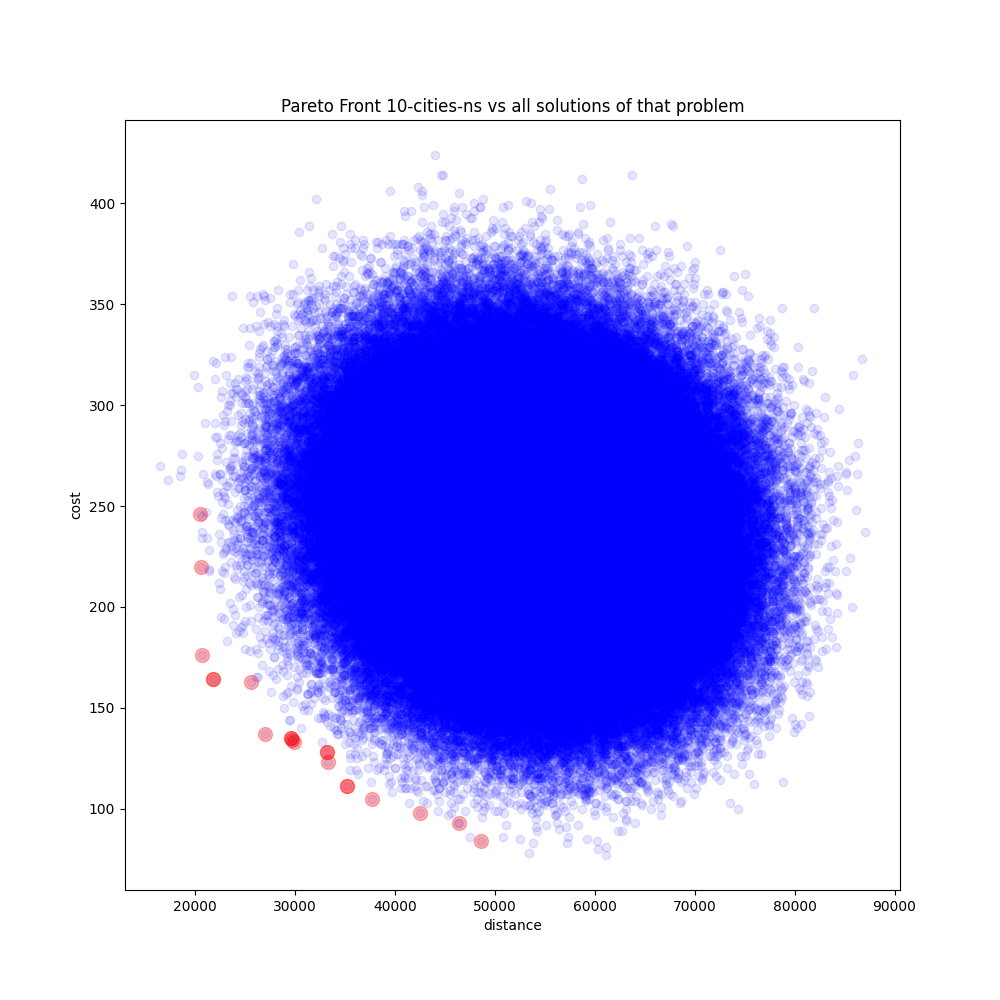
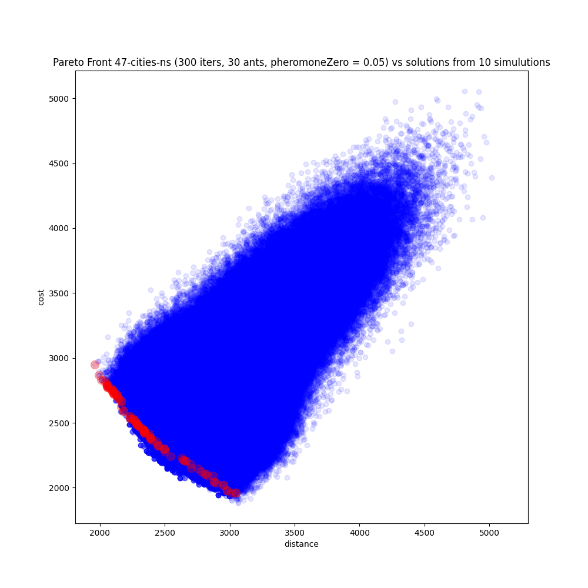
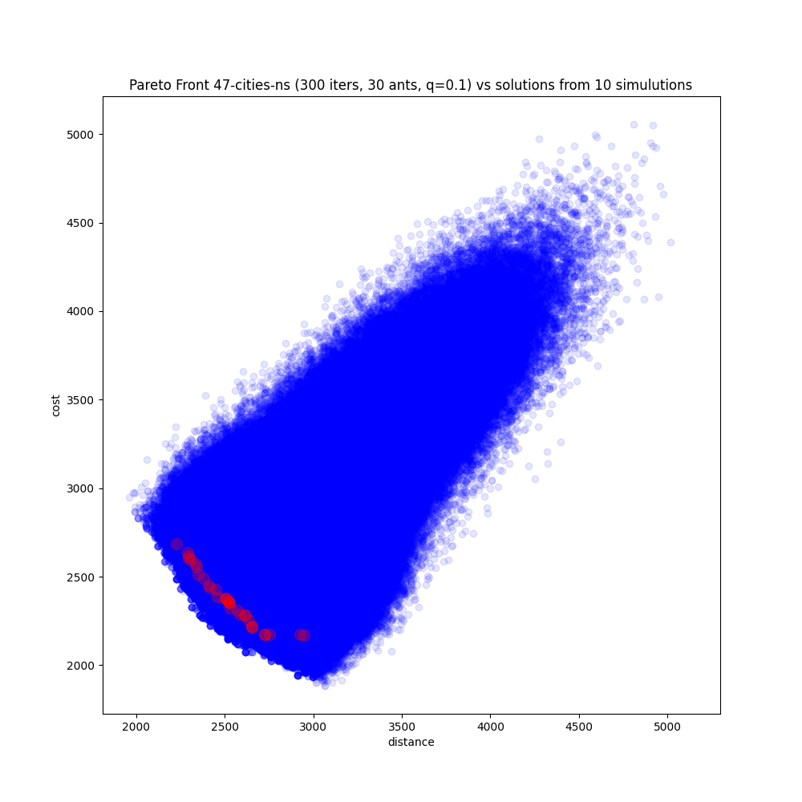
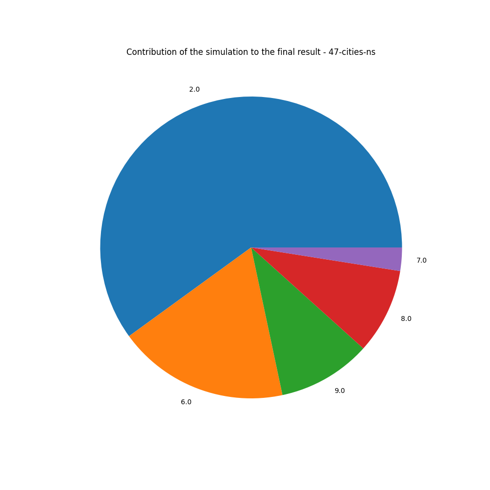

# n-dimensions asymetric traveling salesman problem (ATSP) solved by ACO
LANGUAGE=POLISH

## Opis problemu

Celem działania programu jest znalezienie optymalnych rozwiązań w sensie pareto (pareto front). Rozwiązaniami są wszystkie trasy, które przechodzą przez każde miasto tylko raz, zaś celem algorytmu jest minimaloziwanie n-parametrów tej podróży. W rozwiązaniu tego problemu posłużyłem się dwiema macierzami, które opisują dystans pomiędzy każdą parą miast oraz cenę takiej podróży.
Przykład macierzy:\
0	    76	418	490	781\
76	0	    50	338	390\
418	50	0	    901	242\
490	338	901	0	    404\
781	390	242	404	0\
\
Gdzie wiersze i kolumny odpowiadają kolejnym miastom, zatem dystans pomiędzy miastem numer 0 i 3 będzie miał wartość 490.

## Działanie algorytmu
Algorytm ten jest algorytmem mrowiskowym, gdzie pewna populacja m-mrówek przeszukuje przestrzeń możliwych rozwiązań, pozostawiając za sobą ślad feromonowy. Jeśli przestrzeń rozwiązań jest grafem skierowanym, wierzchołki symbolizują miasta, to ślad feromonowo będzie się odkładał na krawędziach łączących dwa wierzchołki. Każda mrówka staje przed wyborem kolejnego miasta do którego się uda, destynacja obierana jest na podstawie wartości kosztu takiej podróży (minimalizacja n-wartości np. dystansu, ceny) oraz śladu feromonowego. Odwiedzone już miasta dodawane są do listy tabu, zatem mrówka może wybierać tylko miasta jeszcze nieodwiedzone. Po każdym takim przejściu odkłada się pewna ilość feromonu (feromon lokalny), zaś po całym cyklu (m-mrówek przejdzie przez k-miast) rozwiązania dotychczas najbardziej optymalne premiowane są dodatkową porcją śladu feromonowego (feromon globalny). Po wykonaniu i-cykli algorytm kończy działanie i zwracany zbiór optymalnych rozwiązań. Jeżeli n równa się 1, to wtedy jest to klasyczny problem komiwojażera.

### Kilka kroków opisujących działanie algorytmu:

1. W każdym mieście rozstaw $m \over k$ mrówek. W moim algorytmie jest to zmienna `antsInCity`, zatem sumarycznie mrówek jest antsInCity * k.

2. Każda mrówka wykonuje krok do jednego z dostępnych miast (najpierw jest ich k-1, potem k-2, k-3, ... 1).\
    Wylosuj wartość z zakresu [0.0,1.0). Jeśli mniejsza niż *q* to eksploracja, w przeciwnym wypadku eksploatacja.\
    Eksploracja polega na wyborze z dostępnych miast według prawdopodobieństwa danego wzorem:

    $\tau_{ij}^\alpha * \eta_{ij}^\beta \over{\sum_{r=1} \tau_{ir} ^\alpha * \eta_{ir}^\beta}$

    gdzie:\
    i - miasto obecne\
    j - miasto docelowe\
    $\alpha$ - współczynnik wagi śladu feromonowego\
    $\beta$ - współczynnik wagi heurystyki\
    $\tau$ - ślad feromonowy na krawędzi i-j\
    $\eta$ - wartość heurystyczna dana wzorem:

    $\sum_{l=1} \frac{1}{d_{ijl}}$

    gdzie:\
    d - koszt podróży z jednego miasta do drugiego\
    l - kolejne wartości (dystans, cena, czas ...)

    Eksploatacja polega na wyborze miasta, które ma największą wartość wskaźnika danego wzorem:

    $\tau_{ij}^\alpha * \eta_{ij}^\beta$

\
    Natępnie zostaje zaktualizowany lokalny feromon zgodnie ze wzorami:\
    Dla krawędzi, przez które przeszło k mrówek:\
    $\tau_{ij}(t+1) = (1-\rho) * \tau_{ij}(t) + k*\rho*\tau_0$\
    Dla pozostałych:\
    $\tau_{ij}(t+1) = (1-\rho) * \tau_{ij}(t)$

\
    gdzie:\
    $\rho$ - vaporize Factor 0 <= $\rho$ <= 1 (symulacja parowania śladu feromonowego)\
    $\tau_0$ - wartość inicjalna śladu feromonowego dla krawędzi - `pheromoneZero`\
\
    Powtarzaj dopóki każda mrówka nie odwiedzi k-miast.\
\
3. Zaktualizuj globalny ślad feromonowy dla najlepszy rozwiązań zgodnie ze wzorem:
    $\tau_{ij}(t+k) =  (1-\rho) * \tau_{ij}(t) + \rho*\frac{1}{L}$\
    gdzie:
    L - sumaryczny koszt podróży dla danej trasy\
    Zaś dla pozostałych:\
    $\tau_{ij}(t+k) =  (1-\rho) * \tau_{ij}(t)$

4. Wykonuj krok 2-3 dopóki nie zostanie zrealizowana zadana liczba iteracji `maxCylce`.

### Parametry, które może ustawić użytkownik
`maxCycle` - zadana liczba \
`antsInCity` - liczba mrówek rozstawianych w każdym z k-miast\
`alpha` - parametr $\alpha$\
`beta` - paramet $\beta$\
`q` - parametr q determinujący szansę na eksplorację i eksploatację\
`vaporizeFactor` - parametr determinujący współczynnik odparowania feromonu\
`pheromoneZero` - wartość inicjalnego śladu feromonowego\
\
Ponadto w programie znajduje się sekcja, gdzie mogą być ustawianie ścieżki do odpowiednich plików oraz delimiter, ważne jest, aby dane były zgodne ze wzorcem ładowania dla funkcji `np.genfromtxt`.\
\
Dodatkowo wprowadzane macierze są normalizowane.

## Rezultaty działań
Skrypty createPoints służą do tego, aby wykreować chmurę rozwiązań i móc ją porównać z wyznaczonym pareto frontem.\
createPoints1 sprawdzi się dla niewielkich macierz, do rozmiaru 10x10 (k-miast = 10).\
createPoints2 okazał się nieefektywny miał natomiast kreować chmurę punktów dla większych k.\
createPoints3 to algorytm mrowiskowy, tylko zamiast zwracać front pareto, zwraca wszystkie odkryte rozwiązania.\
\
Skrypt visualize służy do przedstawienia rezultatów w formie wykresu punktowego.\
\
Badania zostały przeprowadzone na zbiorze 5,10,47 miast.\
Dla 5 i 10 miast algorytm był w stanie w dość krótkim czasie wskazać optymalne rozwiązanie.\
Dla zbioru 47 miast algorytm w trakcie 300 iteracji oraz 30 mrówek na miasto, nie był w stanie wskazać najbardziej optymalnego znanego rozwiązania. Wynosi ono: 1776, zaś algorytm zwrócił wartość 1805.\
Dla tego samego zbioru w trakcie 250 iteracji oraz 100 mrówek na miasto, algorytm wskazał rozwiązanie o wartości 1776.\
Dla zbioru 70 miast w trakcie 250 iteracji oraz 100 mrówek na miasto wskazana trasa ma długość 39655, a optymalna 38673\
Dla tago samego zbioru w trakcie 400 iteracji oraz 150 mrówek na miasto wskazana trasas ma długość 39290
\
Dla przykładów 2-wymiarowych wizualizacje zostały umieszczone poniżej; aby zastosować dwie różne macierze posłużyłem się jedną macierzą, dla dystansu była ona w formie pierwotnej, dla ceny podróży była transponowana.\
Wszystkie poniższe wizualizacje posiadają domyślne parametry: q = 0.6, $\alpha$ = 1, $\beta$ = 2, $\tau_0$ = 0.1, vaporizeFactor = 0.05, a ilość mrówek to liczba mrówek na miasto. Ponadto są to problemy *niesymetryczne*\
10 miast:\
\
47 miast:\
\
\
\
\
\
\
\
\
\
\
\

## Dane
Przykładowe macierze oraz znane optymalne rozwiązania można znaleźć na stronie: [TSPLIB] (http://comopt.ifi.uni-heidelberg.de/software/TSPLIB95/ “TSPLIB”)\
Macierze pochodzące z tej strony należy przystować do używania przez program np. poprzez wycięcie odpowiednich wierszy z przodu, zastosowanie komendy\
`awk '{$1=$1;print}'` następnie:
```
#!/bin/bash
i=0
while IFS=" " read -a fields; do
    printf "%s\t" "${fields[@]}";
    i=$(($i+1))
    if [ "$i" == "<odpowiednia_liczba_wierszy" ] ; then
	    printf "\n"
	    i=0
    fi
done <plik_z_rezultatem_awk>
```
I ponowne zastosowanie `awk '{$1=$1;print}'`

## Bibliografia
[Programowanie mrowiskowe w procesie aproksymacji funkcji, Mariusz Boryczka](https://books.google.pl/books/about/Programowanie_mrowiskowe_w_procesie_apro.html?id=77qhBAAACAAJ&redir_esc=y)\
[Ant colonies for the travelling salesman problem, Marco Dorigo](https://doi.org/10.1016/S0303-2647(97)01708-5)
